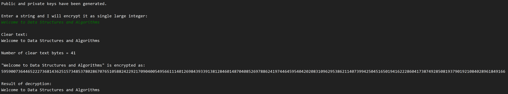

# Merkle-Hellman Knapsack Cryptosystem Demo
**Author:** Stephen Tse \<[redacted]@cmu.edu\>

A demonstration of the [Merkle-Hellman Knapsack Cryptosystem](https://en.wikipedia.org/wiki/Merkle%E2%80%93Hellman_knapsack_cryptosystem), one of the earliest public key cryptosystems in 1970s. It should have been coded in C though, as bit manipulation on strings in Java is suprisingly troublesome and inefficient, but well here's assignment requirement to you... :/

Because the algorithm generates large public / private keys proportional to the maximum bits of a message to be encrypted, this demo limits the maximum characters allowed per turn to 150. Nontheless, it already consumed about 433MB RAM on my computer! Consider reducing `MAX_CHARS` if this is still too much for your machine.

Note that the cryptosystem has been cracked by [a polynomial-time algorithm](https://doi.org/10.1109%2FSFCS.1982.5).

